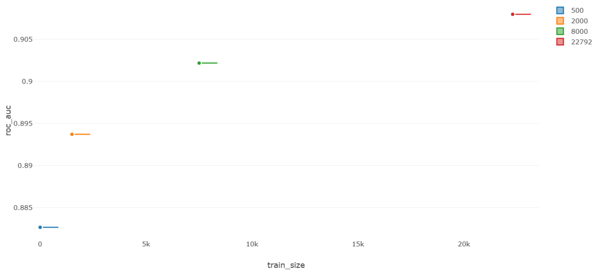

# Отчёт по экспериментам — homework_student27

**Датасет:** Adult Census Income (`scikit-learn/adult-census-income`)  
**Задача:** бинарная классификация (доход >50K или ≤50K)  
**Эксперимент в MLflow:** [`homework_student27`](http://158.160.2.37:5000/#/experiments/35)  
**Ключевая метрика:** ROC-AUC

---

## Разрез 1 — Тип модели

**Гипотеза:** ансамблевые методы (RF, GradientBoosting) дадут более высокий ROC-AUC, чем линейные модели и одиночное дерево.

**Фиксировано:** все 14 признаков, `train_size = 10 000`  
**Параметр:** тип классификатора

| Модель | ROC-AUC |
|---|---|
| LogisticRegression | 0.8126 |
| DecisionTreeClassifier | 0.8662 |
| RandomForestClassifier | 0.9040 |
| GradientBoostingClassifier | **0.9206** |

**Вывод:** гипотеза подтвердилась. GradientBoosting показывает наилучший результат (+0.008 к RF), LogisticRegression значительно уступает ансамблям — вероятно, из-за нелинейных зависимостей в данных. DecisionTree занимает промежуточное положение: лучше линейной модели, но хуже ансамблей из-за переобучения на отдельных ветках.

---

## Разрез 2 — Размер обучающей выборки

**Гипотеза:** увеличение размера датасета монотонно увеличивает ROC-AUC, однако прирост замедляется при больших объёмах данных.

**Фиксировано:** RandomForestClassifier, `n_estimators = 100`, все 14 признаков  
**Параметр:** `train_size` ∈ {500, 2 000, 8 000, полный (~22 792)}

| train_size | ROC-AUC |
|---|---|
| 500 | 0.8827 |
| 2 000 | 0.8937 |
| 8 000 | 0.9022 |
| full (~22 792) | **0.9080** |

**Вывод:** гипотеза подтвердилась полностью. Зависимость монотонная, но с убывающей отдачей — разница между 500 и 2 000 составляет +0.011, а между 8 000 и полным датасетом — лишь +0.006. Уже при 8 000 примерах модель достигает ~99% качества от «полного» обучения.

---

## Разрез 3 — Количество деревьев в RandomForest

**Гипотеза:** увеличение `n_estimators` улучшает ROC-AUC, но после определённого порога прирост становится незначительным.

**Фиксировано:** RandomForestClassifier, `train_size = 5 000`, все 14 признаков  
**Параметр:** `n_estimators` ∈ {10, 50, 100, 200}

| n_estimators | ROC-AUC |
|---|---|
| 10 | 0.8776 |
| 50 | 0.8984 |
| 100 | 0.9005 |
| 200 | **0.9015** |

**Вывод:** гипотеза подтвердилась. Наибольший прирост происходит при переходе с 10 до 50 деревьев (+0.021). Дальнейшее увеличение даёт убывающую отдачу: 50→100 даёт +0.002, 100→200 — лишь +0.001. Использование 100 деревьев — разумный компромисс между качеством и временем обучения.

---

## Лучший запуск

**GradientBoostingClassifier** — ROC-AUC = **0.9206**  
`n_estimators=100`, `learning_rate=0.1`, `max_depth=3`, `train_size=10 000`, все 14 признаков

[Открыть в MLflow UI](http://158.160.2.37:5000/#/experiments/35/runs/3cf07fd4dc404fe5946bbd8aa80f1a2d)
